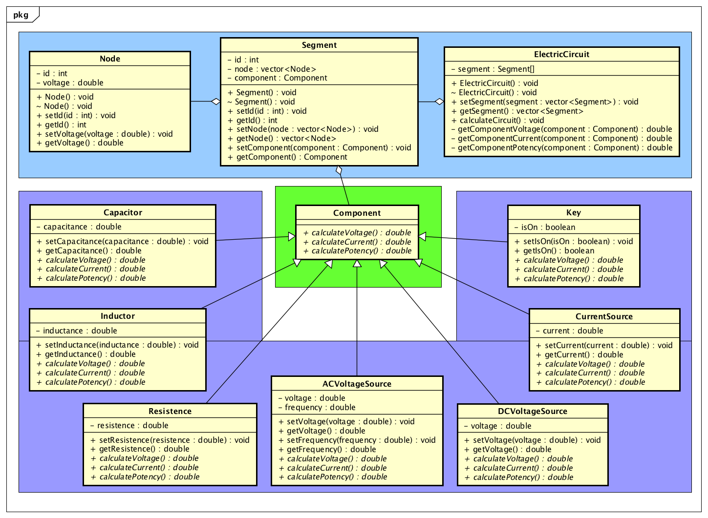

# Electrical Circuits Software
> Project created to improve acknowledgment in object oriented programming.

The objective of this project is to model a software to provide a certain set of classes with methods and attributes that allow to calculate an electric circuit. 

## Getting started

This project contains a UML Diagram to consult the classes.



## Developing

### Built With
 - iostream
 - vector

### Setting up Example

To run the example file, use the code bellow:

```shell
git clone https://github.com/LucasLacerdaBh/electrical-circuits-software
cd electrical-circuits-software/src
g++ main.cpp -o main
./main
```

## Thanks

I like to thank all my friends who help me to develop this project.

## Licensing

Released under the MIT license.
